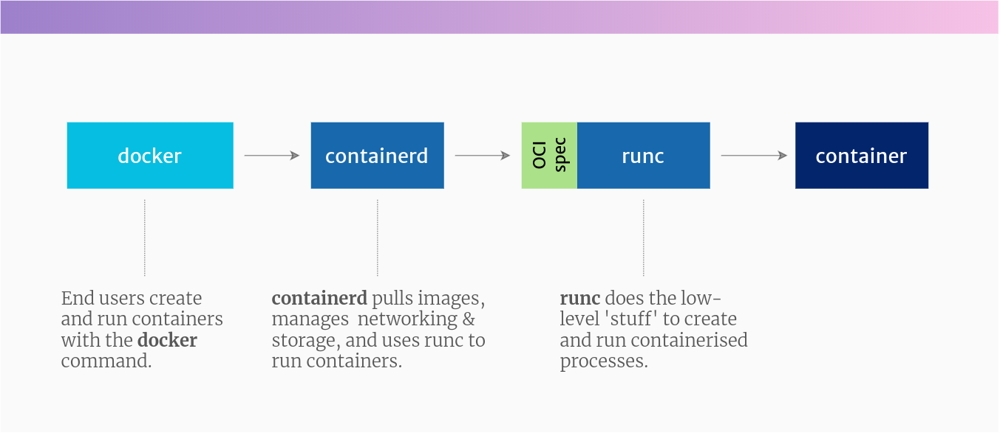

# The differences between Docker, containerd, CRI-O and runc

Since Docker kicked off this explosion in containers, there’s been a growing family of tools and standards to help govern how to use this technology.

Sadly, it’s all rather confusing to keep up with, and the tussles between the big tech companies just add to the confusion for the rest of us.

In this article, I’ll cover all the main names you’ve heard, try to descramble the jargon for you, and explain how the container ecosystem is working together in 2021.

And if you think you’re the only one who doesn’t understand it all, don’t worry…

## Understanding docker

Containers are no longer tightly coupled with the name Docker. There is a whole set of container tools out there, docker being one of them, and Docker (the company) backing some of them, but not all.

So if you were thinking that containers are just about Docker, then continue reading! We’ll look at the ecosystem around containers and what each part does. This is especially useful if you’re thinking of moving into DevOps

> Docker isn't the only container contender on the block.

## The container ecosystem, explained

**The container ecosystem is made up of lots of exciting tech, plenty of jargon, and big companies fighting each other.**

Fortunately, these companies occasionally come together in a fragile truce 🤝 to agree some standards. These standards help to make the ecosystem more interoperable, across different platforms and operating systems, and less reliant on one single company or project.

The main standards to be aware of (although you don’t need to know all the detail) are:

* The Kubernetes `Container Runtime Interface` (CRI), which defines an API between Kubernetes and the container runtime
* The `Open Container Initiative` (OCI) which publishes specifications for images and containers.

This illustration shows exactly how Docker, Kubernetes, CRI, OCI, containerd and runc fit together in this ecosystem:

The relationship between Docker, CRI-O, containerd and runc – in a nutshell

## Docker
We have to start with Docker because it’s the most popular developer tool for working with containers. And for a lot of people, the name “Docker” itself is synonymous with the word “container”.

Docker kick-started this whole revolution. Docker created a very ergonomic (nice-to-use) tool for working with containers – also called `docker`.

