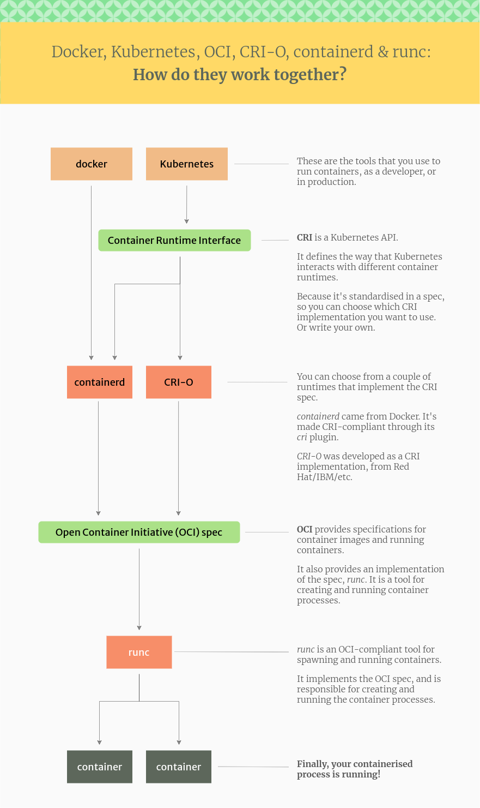
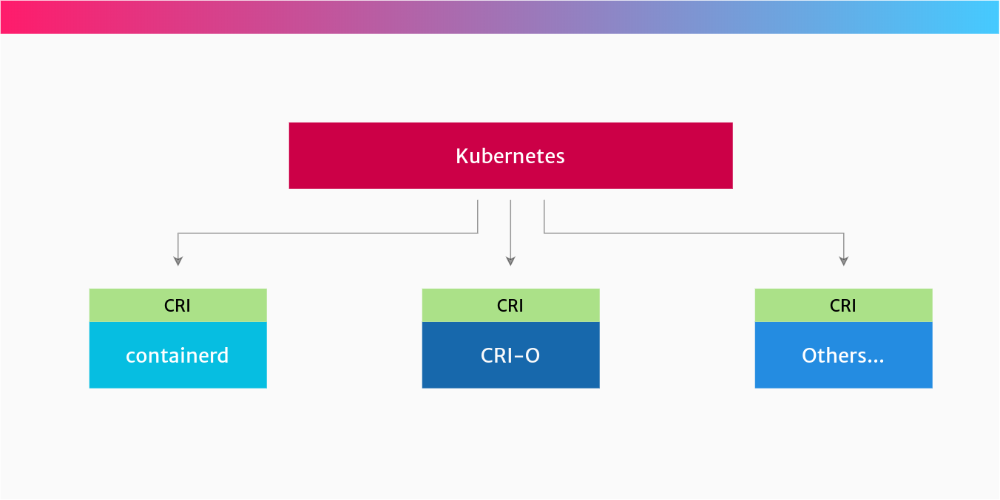

# The differences between Docker, containerd, CRI-O and runc

Since Docker kicked off this explosion in containers, there’s been a growing family of tools and standards to help govern how to use this technology.

Sadly, it’s all rather confusing to keep up with, and the tussles between the big tech companies just add to the confusion for the rest of us.

In this article, I’ll cover all the main names you’ve heard, try to descramble the jargon for you, and explain how the container ecosystem is working together in 2021.

And if you think you’re the only one who doesn’t understand it all, don’t worry…

## Understanding docker

Containers are no longer tightly coupled with the name Docker. There is a whole set of container tools out there, docker being one of them, and Docker (the company) backing some of them, but not all.

So if you were thinking that containers are just about Docker, then continue reading! We’ll look at the ecosystem around containers and what each part does. This is especially useful if you’re thinking of moving into DevOps

> Docker isn't the only container contender on the block.

## The container ecosystem, explained

**The container ecosystem is made up of lots of exciting tech, plenty of jargon, and big companies fighting each other.**

Fortunately, these companies occasionally come together in a fragile truce 🤝 to agree some standards. These standards help to make the ecosystem more interoperable, across different platforms and operating systems, and less reliant on one single company or project.

The main standards to be aware of (although you don’t need to know all the detail) are:

* The Kubernetes `Container Runtime Interface` (CRI), which defines an API between Kubernetes and the container runtime
* The `Open Container Initiative` (OCI) which publishes specifications for images and containers.

This illustration shows exactly how Docker, Kubernetes, CRI, OCI, containerd and runc fit together in this ecosystem:

The relationship between Docker, CRI-O, containerd and runc – in a nutshell

## Docker
We have to start with Docker because it’s the most popular developer tool for working with containers. And for a lot of people, the name “Docker” itself is synonymous with the word “container”.

Docker kick-started this whole revolution. Docker created a very ergonomic (nice-to-use) tool for working with containers – also called `docker`.

`docker` is designed to be installed on a workstation or server and comes with a bunch of tools to make it easy to build and run containers as a developer, or DevOps person.

The `docker` command line tool can build container images, pull them from registries, create, start and manage containers.

To make all of this happen, the experience you know as `docker` is now comprised of these projects (there are others, but these are the main ones):

- **docker-cli:** This is the command-line utility that you interact with using `docker` ... commands.

- **containerd:** This is a daemon process that manages and runs containers. It pushes and pulls images, manages storage and networking, and supervises the running of containers.

- **runc:** This is the low-level container runtime (the thing that actually creates and runs containers). It includes `libcontainer`, a native Go-based implementation for creating containers.

In reality, when you run a container with docker, you’re actually running it through the Docker daemon, containerd, and then runc.

## Dockershim: Docker in Kubernetes

Kubernetes includes a component called `dockershim`, which allows it to support Docker.

Kubernetes prefers to run containers through any `container runtime` which supports its `Container Runtime Interface` (CRI).

But Docker, being older than Kubernetes, doesn’t implement CRI. So that’s why the `dockershim` exists, to basically bolt Docker onto Kubernetes. Or Kubernetes onto Docker, whichever way round you prefer to think of it.

Going forward, Kubernetes will remove support for Docker directly, and prefer to use only container runtimes that implement its Container Runtime Interface. This probably means using containerd or CRI-O.

**But this doesn’t mean that Kubernetes won’t be able to run Docker-formatted containers**. Both `containerd` and `CRI-O` can run Docker-formatted (actually OCI-formatted) images, they just do it without having to use the docker command or the Docker daemon.

Phew. Hope that cleared that up.

## Docker image

**What many people refer to as Docker images, are actually images packaged in the `Open Container Initiative` (OCI) format.**

So if you pull an image from Docker Hub, or another registry, you should be able to use it with the `docker` command, or on a Kubernetes cluster, or with the `podman` utility, or any other tool that supports the OCI image format spec.

## Container Runtime Interface (CRI)

**CRI is the API that Kubernetes uses to control the different runtimes that create and manage containers.**

CRI makes it easier for Kubernetes to use different container runtimes. Instead of the Kubernetes project having to manually add support for each runtime, the CRI API describes how Kubernetes interacts with each runtime. So it’s up to the runtime how to actually manage containers, as long as it obeys the CRI API.

So if you prefer to use `containerd` to run your containers, you can. Or, if you prefer to use `CRI-O`, then you can. This is because both of these runtimes implement the CRI spec.

If you’re an end user, the implementation mostly shouldn’t matter. These CRI implementations are intended to be pluggable and seamlessly changeable.

**Your choice of runtime might be important if you pay to get support (security, bug fixes etc) from a vendor**. For example, Red Hat’s OpenShift uses `CRI-O`, and offers support for it. Docker provides support for their own `containerd`.

## containerd

**`containerd` is a high-level container runtime that came from Docker, and implements the CRI spec. It pulls images from registries, manages them and then hands over to a lower-level runtime, which actually creates and runs the container processes.**

`containerd` was separated out of the Docker project, to make Docker more modular.

So Docker uses `containerd` internally itself. When you install Docker, it will also install `containerd`.

`containerd` implements the Kubernetes `Container Runtime Interface` (CRI), via its `cri` plugin.

## CRI-O

**`CRI-O` is another high-level container runtime which implements the Container Runtime Interface (CRI). It’s an alternative to `containerd`. It pulls container images from registries, manages them on disk, and launches a lower-level runtime to run container processes.**

Yes, CRI-O is another container runtime. It was born out of Red Hat, IBM, Intel, SUSE and others.

It was specifically created from the ground up as a container runtime for Kubernetes. It provides the ability to start, stop and restart containers, just like `containerd`.

## Open Container Initiative (OCI)

**The OCI is a group of tech companies who maintain a specification for the container image format, and how containers should be run.**

The idea behind the OCI is that you can choose between different runtimes which conform to the spec. Each of these runtimes have different lower-level implementations.

For example, you might have one OCI-compliant runtime for your Linux hosts, and one for your Windows hosts.

This is the benefit of having one standard that can be implemented by many different projects. This same “one standard, many implementations” approach is in use everywhere, from Bluetooth devices to Java APIs.

## RUNC

**`runc` is an OCI-compatible container runtime. It implements the OCI specification and runs the container processes.**

`runc` is called the reference implementation of OCI.

### What is a reference implementation?

>A reference implementation is a piece of software that has implemented all the requirements of a specification or standard.
>It’s usually the first piece of software which is developed from the specification.
>In the case of OCI, runc provides all the features expected of an OCI-compliant runtime, although anyone can implement their own OCI runtime if they like.

`runc` provides all of the low-level functionality for containers, interacting with existing low-level Linux features, like namespaces and control groups. It uses these features to create and run container processes.

A couple of alternatives to `runc` are:

* `crun` a container runtime written in C (by contrast, runc is written in Go.)

* `kata-runtime` from the Katacontainers project, which implements the OCI specification as individual lightweight VMs (hardware virtualisation)

* `gVisor` from Google, which creates containers that have their own kernel. It implements OCI in its runtime called runsc.

### What's the equivalent of runc on Windows?

> `runc` is a tool for running containers on Linux. So that means it runs on Linux, on bare metal or inside a VM.
>On Windows, it’s slightly different. The equivalent of runc is Microsoft’s Host Compute Service (HCS). It includes <u>a tool called runhcs, which itself is a fork of runc</u> , and also implements the Open Container Initiative specification.

## Summary

And that’s it. In this article we’ve seen that Docker is just one small part of the ecosystem of containers.

There is a bunch of open standards which make it easier to swap out different implementations. This is where we get the standards CRI and OCI, and projects like `containerd`, `runc` and `CRI-O`.

With everyone busy working on all this new tech, expect this to change rapidly, as things progress.

Now you know everything there is to know about the fun and slightly over-complicated world of containers.

But the next time you’re at a party 🎈, just don’t tell the host you’re using “Docker containers”….

**Reference: https://www.tutorialworks.com/difference-docker-containerd-runc-crio-oci/**